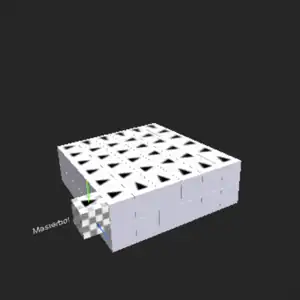

# SP-CellBots – A Simulator for Programmable Matter

Sven Pohl B.Sc. <sven.pohl@zen-systems.de> — MIT License © 2026  
This project is licensed under the [MIT License](./LICENSE).

**SP-CellBots** is an open simulation and control system for programmable matter.  
It is based on a fictional hardware model: the **SP-CellBot**, a modular unit capable of moving across identical elements, stacking, and forming fixed connections in order to *morph* into arbitrary 
structures. 

**Features:**

- **Mobility Modes:** `vehicle_kinematics`, `full_edge` and `hybrid_kinematics` — each with dedicated path planning and movement primitives  
- **Rich API:** Numerous manipulation and diagnostic tools, optimized for LLM-driven control via Codex, Deepseek or Gemini CLI  
- **Structure Morphing:** Support for `full_edge`, sequential and **parallel** VK morphing algorithms  
- **Cryptographic Signatures:** ED25519-based message signing to protect against unauthorized access (pre-configured; generate your own keys before practical deployment)
- **AccessDomainController (ADC):** Multi-MB infrastructure with primary and helper MasterBots, each connected via dedicated WebSocket connectors. Enables higher throughput, lower latency, redundancy, and automatic proximity-based bot-to-MB assignment.

<table>
  <tr>
    <td align="center">
       
      
        AI-generated CellBot concept 
        <i>Image generated with OpenAI (ChatGPT/DALL·E)</i>
      
    </td>
    <td align="center">
       
      
        WebGUI BotController 
        (Screenshot)
      
    </td>
    <td align="center">
       
      
        Morph Animation 
        
      
    </td>
  </tr>
</table>

---

## 📚 Contents

- [Description](docs/description.md)  
- [Installation & Quickstart](docs/install.md)  
- [CellBot Protocol and OP-Codes](docs/protocol.md)  
- [CellBot Hardware Blueprint (Virtual)](docs/hardware_blueprint.md)  
- [Direct Radio](docs/direct_radio.md)  
- [Vehicle Kinematics](docs/vehicle_kinematics.md)  
- [Usage & Examples](docs/usage.md)  
- [API](docs/api.md)  
- [LLM Collaboration](docs/llm_collaboration.md)  
- [Resilience & Error Recovery](docs/resilience.md)  
- [Morphing](docs/morphing.md)  
- [Blender Replay and Animation](docs/blender.md)  
- [Tools (Scripts)](docs/tools.md)  
- [Vision & Future Applications](docs/vision.md)
- [Research Notes](docs/research.md)

---

## 🚧 Planned Features

- **Decentralized AntMorph algorithm (planned):** Swarm-intelligence-based morphing where bots autonomously negotiate target positions without a central wave planner – inspired by ant colony behaviour and decentralised decision-making.
- **Extended resilience features (planned):** Additional API diagnostics and manipulation commands for deeper fault injection, automated recovery sequences, and multi-hMB redundancy handling.

---

## 🧩 Version

Current version: **2.0.2**  
Developed and tested on **Node.js v26.0.0**.  
Due to rapid ecosystem changes, newer or older versions may cause incompatibilities.

Latest changes:

- **2.0.2** (19.07.2026)
**ClusterSim Snapshot feature & VK2 single-morph fallback**
  - **Snapshot Save/Load** in ClusterSim: current bot positions can be saved to `constructs/_snapshot.xml` and restored later via WebGUI buttons or CLI (`node api.js save_snapshot` / `load_snapshot`). MasterBots (hMB1, hMB2) are preserved during load – only cluster bots are replaced.
  - **`parallel_vehicle_kinematics_2` fallback**: if the morph planner gets stuck with parallel waves (`max_paths_in_wave=14`), it automatically retries with single-bot waves (`max_paths_in_wave=1`). This resolves complex reverse-morph scenarios (e.g. table → base_72) where parallel path planning fails due to collision density.

- **2.0.1** (18.07.2026)  
**Bot type `1` – immobile platform bot \& VoxelEdit API fixes**  
  - **New bot type system**: `type=0` (default, mobile) and `type=1` (immobile platform bot, routing-capable, since v2.0.1). Configured via `<type>` tag in ClusterSim XML constructs. The `type` field is transmitted through the entire chain: XML → bot_class → RINFO → BotController → API (`get_bot_info` now returns `"type": 1` for immobile bots).  
  - **`type=1` implicitly sets `mobility=false`** in both ClusterSim (XML loading) and BotController (RINFO handler). Separately, any bot can be set `mobility=false` without changing its type (e.g. temporarily immobilised after a fault) – the two axes are independent.  
  - **WebGUI: `:voxeledit` in structure dropdown**: The `requestsequences` handler now appends `:voxeledit` to the structure list, making it selectable in the WebGUI.  

- **2.0** (16.07.2026)  
**VoxelEdit API – LLM-driven structure generation and analysis**  
  - **17 `ve_`-commands** for creating, editing, and analysing voxel structures via API: `ve_set_voxel`, `ve_create_box`, `ve_get_voxels`, `ve_show`, `ve_save`, `ve_load`, `ve_gravity`, `ve_is_connected`, and more.  
  - **Set-based editing**: independent sub-structures (e.g. table legs) can be created, copied (`ve_duplicate`), moved (`ve_translate`), and deleted independently within the same design.  
  - **`ve_is_connected`** checks whether the structure forms a single connected component and whether any voxel has orthogonal contact to the existing cluster.  
  - **`ve_gravity`** estimates static weight distribution per y-level.  
  - **`morph_start :voxeledit`** morphs the current voxel design directly – no file save required.  
  - **WebGUI visualisation** as semi-transparent purple cubes.  
 
- **1.9.7** (12.07.2026)  
**First approach to direct re-morphing in Vehicle Kinematics mode (Parallel Vehicle Kinematics Morph 2)**  
  - **`parallel_vehicle_kinematics_2`** now supports `emptyArea` bounding boxes: surplus bots inside the emptyArea that are not at target positions are automatically detected and moved to cleanup targets outside the area during the same morph pass.  
  - **Working test structures**: `25_l4` ↔ `25_l5` (4-bot roundtrip).  

- **1.9.6** (11.07.2026)  
**`get_address_route` API command and reverse-morph fix**  
  - **`get_address_route`**: New API command that traces a routing address step by step through the current cluster, returning coordinates, bot ID, and orientation for each hop. L/R slot mapping fixed.  
  - **Reverse-morph fix**: `base_72` with `set_mobility.batch` completes successfully again.  

- **1.9.5** (08.07.2026)  
**Batch-Controller: Condition-based sequential test execution**  
  - `node api.js batch <file.batch>`: Executes a .batch JSON file with sequential blocks  
  - `node api.js batch <file.batch>#label`: Jump to a specific block by id or label  
  - **Condition matching**: `"blockId:dot.path": "expected"` – links block results via JSON dot-path navigation  
  - **Parallel execution**: `"parallel": ["cmd1", "cmd2"]` – runs multiple commands simultaneously  
  - **Auto-fallback**: batch files in `tests/` subdirectory are found automatically  
  - `node api.js sleep <ms>`: CLI-only blocking wait command  
  - Reconnect/auto-scan fix: ADC connector sockets re-initialise when BotController starts before ClusterSim  

- **1.9.4** (06.07.2026)  
**ADC-Morph: Multi-MasterBot Support for Vehicle Kinematics & Full-Edge**  
  - Morph address computation and command dispatch moved from single primary MB to distributed ADC (AccessDomainController)  
  - RALIFE return routing to nearest MB/hMB (Manhattan distance)  
  - `draw_path_for_bot <id> <x> <y> <z>`: Calculate path and display as coloured markers in WebGUI  
  - Documentation update: `docs/resilience.md`, `docs/api.md` expanded, README revised

- **1.9.3** (02.07.2026)  
**Extended Resilience Controller & Failure Injection**  
  - 18 fault types identified, injectable and diagnosable – see [Resilience & Error Recovery](docs/resilience.md) for details  
  - `config_corrupt_msg`, `config_msg_delay`, `config_max_msgqueue`: New ClusterSim failure-injection commands  
  - `config_duplicate_msg`, `config_disable_forwarding`, `config_fakeid`: Extended failure injection

- **1.9.2** (27.06.2026)  
**ClusterSim Obstacles & Slot Reliability**  
  - `set_obstacle true/false <x> <y> <z>`: Place/remove obstacles in ClusterSim – blocks MOV and SPIN commands (functional mesh blocking). Use `forbidden_add` on BotController side for path planner awareness  
  - `config_slot <bot_id> "<slot>:<prob>"`: Configure per-slot reliability (0.0–1.0) on individual bots to simulate dirty/corrupted link interfaces – affects both outgoing and incoming traffic  
  - `verify_bot_position`, `trace_move_path`, `integrate_bot`: New resilience diagnostics  
  - ClusterSim failure-injection API (port 3101): `disable_bot`, `enable_bot`, `set_mobility`, `get_bot_info`, `describe`, `teleport_bot_to`, `add_bot_to`, `set_move_interruption`, `config_slot`, `set_obstacle`, `get_status`

- **1.9.1** (24.06.2026)  
**Resilience Controller & World Model Consistency Tools**  
  - `resilience_controller.js`: Central event collector framework for unusual bot behaviour – designed for future error-handling extensions (timeout detection, ping verification, automatic recovery)  
  - `diagnose_bot_address <bot_id>`: Walks the mesh address path of any bot hop by hop and checks each intermediate position for inactive bots via targeted CHECK commands. Detected inactive bots are automatically registered and addresses are recalibrated – no full Level 2 scan required  
  - `set_active <bot_id> <true|false>`: Activate or deactivate a bot in the world model. Deactivated bots are excluded from morph donor selection and their positions are treated as forbidden by the path planner  
  - `set_mobility <bot_id> <true|false>`: Set a bot's mobility flag. Immobile bots remain in the mesh for signal forwarding but are excluded from morph operations  
  - `check_if_inactive <x> <y> <z>`: Surgical offline-check – finds a neighbor bot, sends a targeted CHECK command, and registers the position as inactive if an OFFL status is detected  
  - ClusterSim failure-injection API (port 3101): `disable_bot`, `enable_bot`, `set_mobility`, `get_bot_info`, `describe`  
  - First automatic self-repair: Resilience Controller detected hMB2 (or another helper-MasterBot) contact loss, disabled the MB and redistributed bots via `adc_assign_proximity`

- **1.9** (19.06.2026)  
**AccessDomainController (ADC) – Multi-MB infrastructure**  
  - Legacy single-MasterBot replaced by primary MB + helper MBs (hMB1, hMB2)  
  - Each MB connected via dedicated connector (shared/exclusive WebSocket slots)  
  - Configuration via `config_mb.xml`  
  - Parallel cluster scanning across all MBs for higher throughput  
  - Automatic proximity-based bot-to-MB assignment (`adc_assign_proximity`)  
  - Disable/enable MBs at runtime (`disable_mb`, `enable_mb`) with automatic bot redistribution  
  - `adc_auto_assign_proximity` config flag for post-move reassignment  
  - FullEdge BFS wavefront morphing fully operational over new ADC infrastructure  
  - Vehicle kinematics morphing runs stably over ADC  
  - New API: `generate_detour_address`, `adc_assign_proximity`, `disable_mb`, `enable_mb`

- **1.8** (07.06.2026)  
**NightWatch – watch_region auto-ping system for world model consistency**  
  - `watch_region`: Create/update observed 3D regions with periodic random pings  
  - `create_watch_region`: High-level shortcut with auto-ID and outer_bots filter  
  - `ping_position` / `ping_status`: Ping a coordinate and verify bot presence  
  - `watch_region poll`: Detects BOT_MISSING, UNEXPECTED_BOT changes vs snapshot  
  - Auto-snapshot on region creation, masterbot excluded from pings  
  - `outer_bots`: Only monitors cluster-surface bots (<6 neighbors)

- **1.7.9** (05.06.2026)  
**ping_position / ping_status API – BotController world model improvements**  
  - `ping_position x y z`: Ping a coordinate via INFO opcode, returns tmpid  
  - `ping_status tmpid`: Check if a bot responded (bot_found, bot_id, position)

- **1.7.8** (31.05.2026)  
**Shepherd experiments, get_bot_info API, test structures**  
  - New: `get_bot_info <id>` – position, orientation, adress, payload, neighbors in one call  
  - New: shepherd experiment prompts (exp03–exp09) in botcontroller/  
  - New: test structures (target1–4, pins.json)  
  - `grab_bot` uses B-slot (back) in VK mode

- **1.7.7** (23.05.2026) — **get_bots_in_region API, would_split_cluster in diagnose, CLI fixes**

- **1.7.6** (23.05.2026)  
**Parallel Vehicle-Kinematics Morph & Auto Structurescan**

- **1.7.5** (18.05.2026)  
**3D Cursor for rapid Vehicle-Kinematics Moves & LLM Collaboration Guide**

- **1.7.4** (17.05.2026) — **Vehicle Kinematics Payload — B-Slot Transport & WebGUI API CLI**

- **1.7.3** (12.05.2026) — **Hybrid Kinematics mobility mode (API preview)**
- **1.7.2** (03.05.2026) — **Sequential Vehicle Kinematics Morph**
- **1.7.1** (29.04.2026) — **VoxelEdit integration**
- **1.7** (28.04.2026) — **Vehicle Kinematics mobility mode (preview)**
- **1.6** (18.04.2026) — **Direct-Radio transition layer and API architecture refactor**
- **1.5** (04.04.2026) — **API V1 becomes practically usable**

👉 Full changelog is available at:  
➡️ [docs/changelog.md](docs/changelog.md)

---

## 📖 How to cite

If you use SP-CellBots in your work, please cite one (or more) of the following:

- **Software (GitHub / CITATION.cff):**  
  Use the repository citation metadata (GitHub “Cite this repository” / `CITATION.cff`).
  
  
 

- **Core concept and opcode protocol:**  
  Pohl, S. (2026). *A Modular and Secure Opcode Protocol for Programmable Matter*. Zenodo.  
  [https://doi.org/10.5281/zenodo.19509605](https://doi.org/10.5281/zenodo.19509605)

- **Applied benchmark / follow-up study:**  
  Pohl, S. (2026). *A Qualitative Benchmark Comparison of Full-Edge and Vehicle Kinematics in SP-CellBots*. Zenodo.  
  [https://doi.org/10.5281/zenodo.20074691](https://doi.org/10.5281/zenodo.20074691)

- **LLM Experiments with Programmable Matter:**  
  Pohl, S. (2026). *LLM Experiments with Programmable Matter: Preliminary Studies with SP-CellBots*. Zenodo.  
  [https://doi.org/10.5281/zenodo.20474601](https://doi.org/10.5281/zenodo.20474601)
  
- **Resilient BotController Strategies for Modular Cubic Robot Clusters:**  
  Pohl, S. (2026). *Resilient BotController Strategies for Modular Cubic Robot Clusters*. Zenodo.  
  [https://doi.org/10.5281/zenodo.21204357](https://doi.org/10.5281/zenodo.21204357)  
  
---

## 🚧 Planned Features

- **Decentralized AntMorph algorithm (planned):**  
  A lightweight, swarm-based morphing system is in development, inspired by ant behavior.  
  Bots will attempt to fill free target positions without global coordination, based on local visibility and optional heuristics (e.g., cluster center proximity).  
  Goal: support fast and distributed formation of arbitrary patterns in constrained environments.

---

## 🤝 Contributing

Pull requests are welcome!

<strong>„Morph. Code. Forge.“</strong>

## 💛 Support / Donate

If you enjoy this project and want to support ongoing development, feel free to send a Bitcoin donation to:

**BTC address:**  
'bc1qr49kr0cn92wmtne4tasdqe9qzfhj0jqvpxjhha'

> *"If you’d like to say thanks: Even a few sats are appreciated!"*

🙏 Thank you!

---

📬 **Feedback welcome**  
If you're experimenting with CellBots or building something on top of it, I'd love to hear from you.  
Even a short message helps with motivation and future planning.

Feel free to drop a quick note to:  
'sven.pohl@zen-systems.de'
