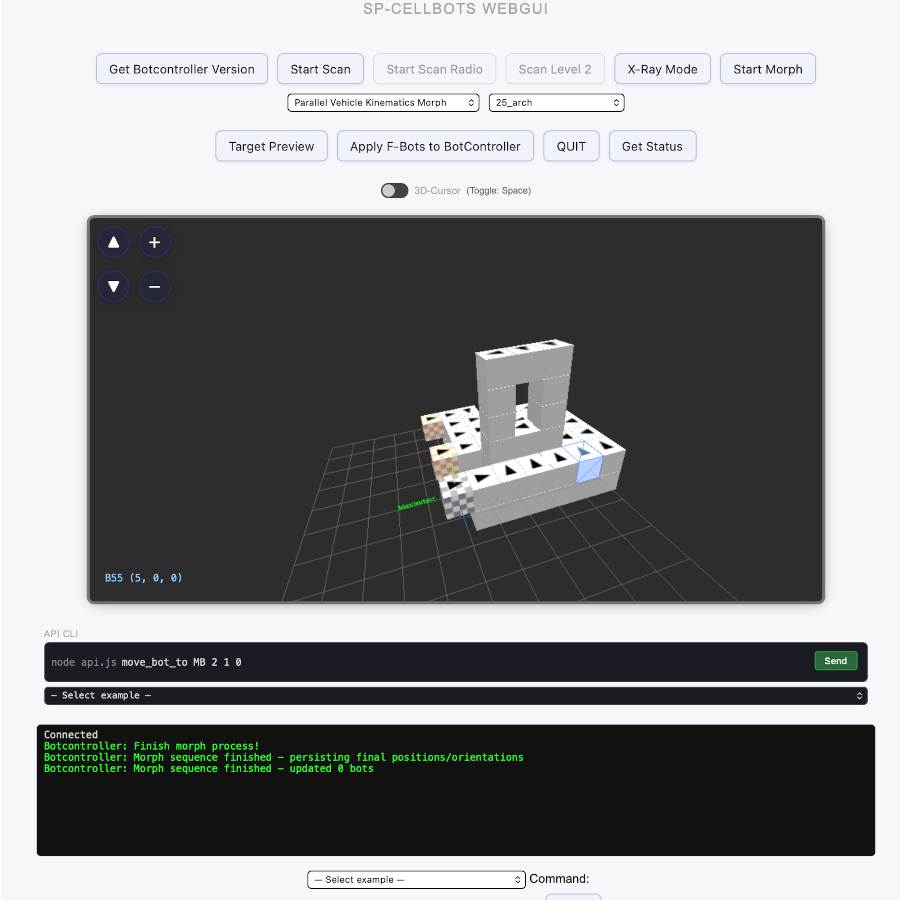

# SP-CellBots – A Simulator for Programmable Matter

Sven Pohl B.Sc. <sven.pohl@zen-systems.de> — MIT License © 2025  
This project is licensed under the [MIT License](./LICENSE).

**SP-CellBots** is an open simulation and control system for programmable matter.  
It is based on a fictional hardware model: the **SP-CellBot**, a modular unit capable of moving across identical elements, stacking, and forming fixed connections in order to *morph* into arbitrary 
structures. 

> ⚠️ Note: The term "CellBots" is used here in a descriptive, non-commercial context and is not affiliated with any external research groups or trademarks.

<strong>„Morph. Code. Forge.“</strong>

<table>
  <tr>
    <td align="center">
       
      
        AI-generated CellBot concept 
        <i>Image generated with OpenAI (ChatGPT/DALL·E)</i>
      
    </td>
    <td align="center">
       
      
        WebGUI BotController 
        (Screenshot)
      
    </td>
    <td align="center">
       
      
        Animated Blender export 
        (Rendering)
      
    </td>
  </tr>
</table>

---

## 📚 Contents

- [Description](docs/description.md)  
- [Installation & Quickstart](docs/install.md)  
- [CellBot Protocol and OP-Codes](docs/protocol.md)  
- [CellBot Hardware Blueprint (Virtual)](docs/hardware_blueprint.md)  
- [Usage & Examples](docs/usage.md)  
- [Morphing](docs/morphing.md)  
- [Blender Replay and Animation](docs/blender.md)  
- [Tools (Scripts)](docs/tools.md)  
- [Vision & Future Applications](docs/vision.md)
- [Research Notes](docs/research.md)

---

## 🧩 Version

Current version: **1.4.1**  
Developed and tested on **Node.js v23.11.0**.  
Due to rapid ecosystem changes, newer or older versions may cause incompatibilities.

Latest changes:

- **1.4.1** (26.03.2026)  
**Preparatory Structure Extension for Planned Repair Demo**
  - Added initial support in BotController for an optional object-based structure format in **`/botcontroller/structures/[structure].json`**
  - Existing plain voxel-array JSON files remain compatible; object-based files now use **`structure`** as the primary target voxel set
  - Introduced preparatory role fields for extended structure definitions: **`carrier`**, **`reserve`**, **`x`** (planned storage area for inactive bots), **`forbidden`** (blocked voxel positions), and BotController-side handling of **`inactive`**
  - Added minimal example file **`/botcontroller/structures/base_25_forbidden.json`** as a first extended-format demo structure
  - BotController now keeps extended structure-role data separate from the main target bot coordinates for future repair and scenario logic
  - Added initial WebGUI visualization for **`forbidden`** positions: exemplar voxels are rendered as semi-transparent dark wine-red markers

👉 Full changelog is available at:  
➡️ [docs/changelog.md](docs/changelog.md)

---

## 🚧 Planned Features

- **Decentralized AntMorph algorithm (planned):**  
  A lightweight, swarm-based morphing system is in development, inspired by ant behavior.  
  Bots will attempt to fill free target positions without global coordination, based on local visibility and optional heuristics (e.g., cluster center proximity).  
  Goal: support fast and distributed formation of arbitrary patterns in constrained environments.

---

## 🤝 Contributing

Pull requests are welcome!

## 💛 Support / Donate

If you enjoy this project and want to support ongoing development, feel free to send a Bitcoin donation to:

**BTC address:**  
'bc1qr49kr0cn92wmtne4tasdqe9qzfhj0jqvpxjhha'

> *"If you’d like to say thanks: Even a few sats are appreciated!"*

🙏 Thank you!

---

📬 **Feedback welcome**  
If you're experimenting with CellBots or building something on top of it, I'd love to hear from you.  
Even a short message helps with motivation and future planning.

Feel free to drop a quick note to:  
'sven.pohl@zen-systems.de'
