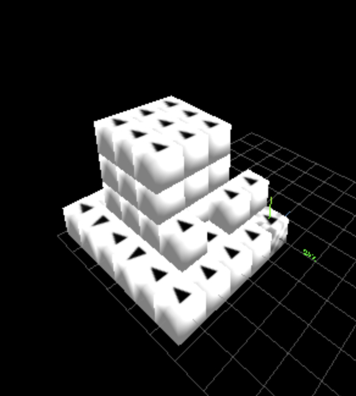
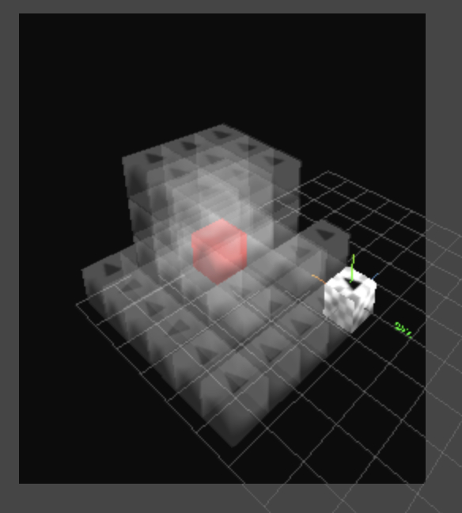
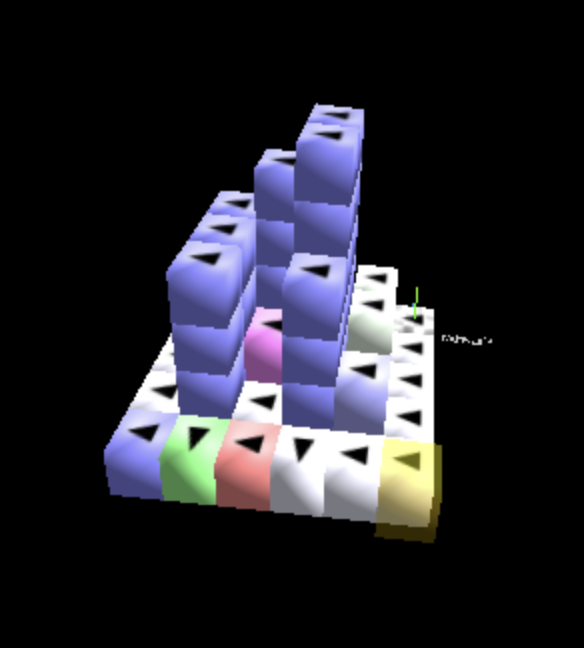

[⬅️ Back to Overview](../README.md)

# API

The **BotController API** provides a programmatic interface for querying structure state, planning movements, executing transport operations, and starting morph runs.

It is designed as a pragmatic control layer for:

- human operators
- scripts
- future LLM-based tooling

The transport is currently:

- **JSON over TCP**
- one request per connection
- one structured response per request

---

## 🎯 Start Here

The most important entry point is the built-in self-description:

```bash
node api.js describe
```

This command prints the currently available API commands together with:

- short descriptions
- expected parameters
- typical return fields

So the API is not only callable, but also largely **self-describing**.

For quick inspection and experimentation, `describe` should usually be the first step.

---

## 🎯 Purpose

The API is intended to make the current simulator stack usable without clicking through the WebGUI.

Typical use cases:

- inspect the current cluster world model
- look up individual bots and neighbors
- calculate paths before execution
- move, rotate, grab, and release bots
- transport a payload with a carrier
- start and monitor morph runs

---

## 🧩 Current Scope

The API is now split into practical command families that can be combined for:

- world introspection and scan orchestration
- runtime role management (`forbidden`, `servicebay`)
- path planning, diagnostics and safe execution
- payload transport and carrier handling
- morph execution and crater build/fill workflows
- raw command access and message queue debugging

---

## 🧪 Small Example

One simple example is:

```bash
node api.js get_bot_by_id B28
```

Typical response:

```json
{
  "ok": true,
  "answer": "api_get_bot_by_id",
  "bot_id": "B28",
  "position": { "x": 3, "y": 1, "z": 2 },
  "orientation": { "x": 1, "y": 0, "z": 0 },
  "adress": "FLLFRT"
}
```

This already shows the basic shape of the interface:

- requests are simple command calls via `api.js`
- responses come back as JSON
- coordinates are returned explicitly as `x`, `y`, `z`
- orientation is also encoded as a vector

---

## 📦 Command Families (Current `describe` Snapshot)

For full parameter/return details use:

```bash
node api.js describe
```

### World and Scan

- `version`
- `get_status`
- `get_status_extended`
- `get_masterbot`
- `get_scan_state`
- `structurescan`
- `structurescan_lvl2`

### GUI and Diagnostics

- `gui_set_marker`
- `gui_clear_markers`
- `gui_refresh`
- `debug_move`
- `get_last_moves`
- `get_bot_history`
- `get_last_raw_cmds`
- `get_api_messages`
- `reset_api_message_log`
- `poll_masterbot_queue`

### Safety and Addressing

- `safe_mode`
- `recalibrate_bot_address`
- `recalibrate_bot_addresses`
- `diagnose_ack_route`

### Runtime Roles (Forbidden / ServiceBay)

- `forbidden_add`
- `forbidden_remove`
- `forbidden_clear`
- `forbidden_list`
- `servicebay_add`
- `servicebay_remove`
- `servicebay_clear`
- `servicebay_list`

### Bot Queries and Path Planning

- `get_bot_by_id`
- `get_bots`
- `get_bots_by_prefix`
- `get_inactive_bots`
- `get_neighbors`
- `get_grab_positions`
- `get_turn_positions`
- `is_occupied`
- `get_slot_status`
- `probe_move_bot`
- `can_reach_position`
- `find_path_for_bot`
- `find_path_for_bot_payload`
- `suggest_simple_move`
- `would_split_cluster`
- `diagnose_move_bot_to`
- `diagnose_move_carrier_to`

### Motion and Transport

- `move_bot_to`
- `rotate_bot`
- `rotate_bot_to`
- `grab_bot`
- `release_bot`
- `move_payload_to`
- `move_carrier_to`

### Morphing

- `morph_get_structures`
- `morph_get_algos`
- `morph_start`
- `morph_check_progress`

### Crater Build / Fill

- `calc_crater`
- `crater_start`
- `crater_check_progress`
- `crater_fill`
- `crater_list`

### Low-Level

- `raw_cmd`

---

## 🛠️ Crater Build

SP-CellBots can now build a **crater algorithmically via API** to create a practical rescue/repair access path to inactive bots, without forcing the LLM to hand-plan every single move.

Typical workflow:

1. detect inactive targets (`Scan II` / `get_inactive_bots`)
2. calculate crater plan (`calc_crater`)
3. execute asynchronous excavation (`crater_start`)
4. extract / service transport with standard transport tools
5. close crater in reverse order (`crater_fill`)

Key properties:

- crater digging supports **all 6 axis directions** (`±x`, `±y`, `±z`), depending on where the inactive bot is located
- the shaft cross-section is explicitly configurable via `sx/sy/sz` (more compact or wider working space)
- each crater run gets a **crater id**, so the generated plan can be tracked and later filled automatically in reverse sequence
- this gives a robust repair baseline: access morphing, payload extraction, service-bay transfer, and structural closure

The following images show the current repair-focused flow:

<table>
  <tr>
    <td align="center">
      <br>
      <sub>
        Repair demo setup<br>
        <sub>(3×3×3 core with hidden inactive bot)</sub>
      </sub>
    </td>
    <td align="center">
      <br>
      <sub>
        X-Ray / Scan II view<br>
        <sub>(inactive bot localized)</sub>
      </sub>
    </td>
    <td align="center">
      <br>
      <sub>
        Morphed crater in ClusterSim<br>
        <sub>(open access channel for rescue/repair)</sub>
      </sub>
    </td>
  </tr>
</table>

This section marks a clear direction of the project: SP-CellBots treats **repair as a first-class capability** and already provides practical, API-driven primitives for simple failure handling.

---

## ⚠️ V1 Notes

The API is already practically useful, but still evolving.

Important characteristics of the current V1-style interface:

- recovery and acknowledgement handling are already integrated for many commands
- `move_carrier_to` is the clearer transport primitive for current payload workflows
- `move_payload_to` currently still targets the **carrier position**, not a payload target pose
- service-bay (`X`) semantics are role-aware:
  - direct movers on `X` can be recycled immediately
  - carried payload bots on `X` are marked pending and recycled on `release`
- `morph_check_progress` distinguishes between:
  - calculation success
  - final sequence completion
- crater workflows now distinguish:
  - `calc_crater` (plan/stub)
  - `crater_start` (async dig execution)
  - `crater_fill` (precheck + optional async fill execution)

Some semantics are intentionally conservative and may still be refined in future versions.
For command details, the built-in `describe` output should be treated as the primary live reference.

---

## 📚 Next Steps

This page is intentionally lightweight and serves as the API entry point.

The next iteration should grow into a fuller V1 reference with:

- a few selected command examples
- guarantees and caveats
- recovery semantics
- transport workflow examples
- morph workflow examples

---

[⬅️ Back to Overview](../README.md)  
**Previous chapter:** [Usage & examples](usage.md) | **Next chapter:** [Morphing](morphing.md)
