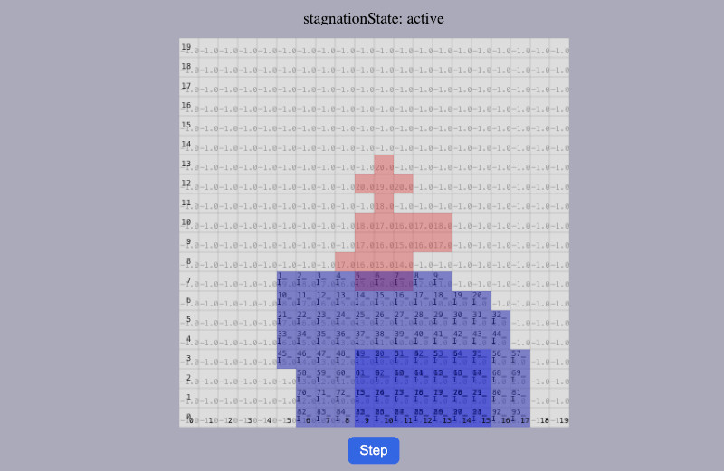
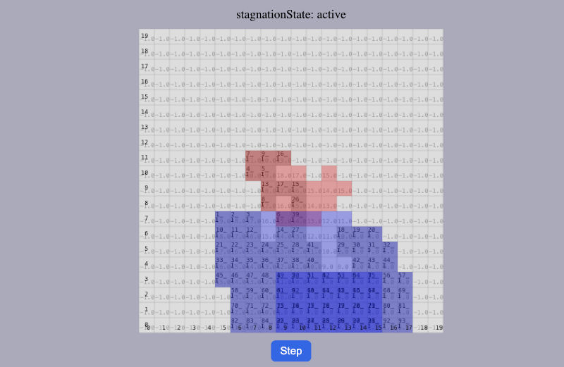

[⬅️ Back to Research-Notes Overview](../research.md)

## Floodfill Approach – Early Concept Notes  
2025-11-29

The floodfill-based morphing idea is motivated by the desire to avoid (or at least significantly reduce)  
the heavy computational cost of classical path planning methods such as BFS or A*.  
Pathfinding in large 3D grids grows expensive very quickly: even a single BFS has a time complexity of  
O(N³) in the worst case, and planning paths for many bots multiplies that overhead further.

The basic intuition of the floodfill approach is to treat the bots like a “fluid” that flows along a  
precomputed gradient field toward the target structure. Instead of navigating externally along the surface,  
bots are pulled *from within the cluster* toward the target region, while always maintaining connectivity  
to the core cluster. The gradient (e.g., distance transform or BFS field) is computed **once** at the start  
of the morph cycle, not at every bot movement step.

This idea produces surprisingly organic motion: bots fill the target region from the inside out,  
following the gradient downhill. However, narrow passages and connectivity constraints mean that certain  
areas may become unreachable. Whenever the system detects such stagnation, control switches to a fallback  
mode using classical path planning. Nearby bots are then routed into the remaining gaps.  
Even though path planning cannot be eliminated entirely, floodfill rapidly completes the majority of  
the morphing process depending on the morphology of the target shape.

---

During the experiments it became clear — as expected — that the morphing dynamics do not only affect the  
target region. In the donor region at the core of the cluster, “bubbles” form naturally as bots move  
toward the gradient source. These bubbles are transported outward until they dissipate at the edges  
of the cluster, similar to the movement of voids in fluids.  
This means the morphing process implicitly involves **the entire cluster**, not only the bots actually  
required for filling the target.

The main disadvantage, and the reason this approach was ultimately not pursued further for SP-CellBots,  
is the expected communication overhead.  
With classical path planning, a bot receives a full movement sequence once and only reports back upon  
arrival. In the floodfill model, however, bots must report their new position **after every single step**.  
For a path of N steps, this increases communication traffic by a factor of N.  
Additionally, the “bubble” bots that refill the gaps created by their predecessors also emit signals,  
increasing traffic even further.

Because SP-CellBots are intentionally designed as minimalist units with no global world knowledge,  
each bot only knows its immediate neighbors. A floodfill system would therefore require continuous  
updates of the local world state as well as constantly refreshed return paths back to the MasterBot.  
The resulting communication load would likely saturate the message network long before large-scale  
morphing could complete.

 
## Screenshots

### Initial setup and first flow patterns

### Later state (another setting) with partial merging and local stagnation

---

 