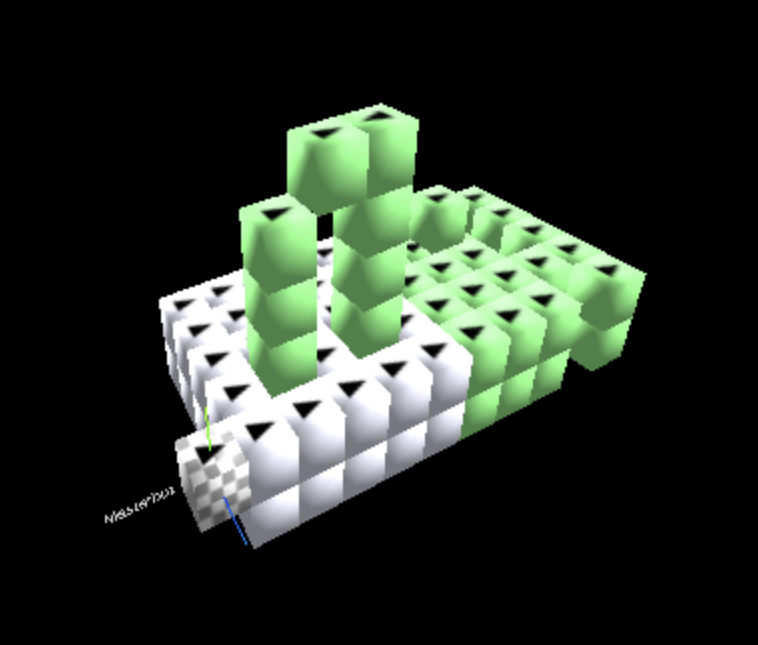

[⬅️ Back to Overview](../README.md)

# Vehicle Kinematics Mode (`vehicle_kinematics`)

Starting with **v1.7**, SP-CellBots introduces the `vehicle_kinematics` mobility mode — a dedicated movement layer that models a **simpler, vehicle-like hardware** for SP-CellBots.  
**v1.7.2** extends this mode with **sequential morphing** (Sequential Vehicle Kinematics Morph), enabling full structure-to-structure transformation under vehicle-kinematics constraints.

---

## Motivation

The `full_edge` mobility mode assumes that a CellBot can move freely in any direction — forward, backward, left, right, up, down — and can rotate arbitrarily. This is the most flexible model, but it also implies complex hardware.

`vehicle_kinematics` deliberately restricts movement to a **vehicle-like locomotion model**:

- Bots move primarily in their **front direction (F-direction)**
- Movement is constrained to forward/backward driving, climbing/gliding along walls, and single-step ascent/descent onto adjacent bots
- The bot must rotate to change its direction of travel — just like a real vehicle

This makes bots **more dependent on gravity** and blocks certain elegant morph paths that `full_edge` would allow. However, the simpler hardware model represents a **realistic intermediate step** in the SP-CellBots evolution toward practical physical deployments.

---

## Comparison: `full_edge` vs `vehicle_kinematics`

| Aspect | `full_edge` | `vehicle_kinematics` |
|---|---|---|
| Movement directions | All 6 directions (F, B, L, R, U, D) | Primarily F-direction (forward/backward) |
| Rotation | Arbitrary, independent of movement | Required to change travel direction |
| Wall climbing | Possible in any orientation | Only in F-direction alignment |
| Gravity dependence | Low | Higher — vehicle must be oriented correctly |
| Path planning | BFS on coordinates | A* on movement states (position + rotation) |
| Hardware complexity | High (full 3D maneuverability) | Lower (vehicle-like drivetrain) |
| Morph path flexibility | High | Restricted — but more realistic for early hardware |

---

## Movement Rules

In `vehicle_kinematics` mode, bot movement follows a set of rules based on the bot's current **position** and **orientation (F-direction)**. Each movement primitive defines:

- **match** — which orientation the bot must have to execute this move
- **pre** — preconditions (which cells must be free or occupied)
- **effect** — how position and orientation change after the move
- **cost** — relative cost for path planning (1 = simple drive, 2 = complex maneuver)

### Drive (Forward / Backward)

A bot can drive one step forward or backward on the same plane, provided the target cell is free and the cell below the target is occupied (support surface).

- **Forward**: The bot moves one step in its F-direction. The F-direction remains unchanged.
- **Backward**: The bot moves one step in its F-direction, but the F-direction flips 180° (the bot ends up facing backward relative to its travel direction).

Both require the cell below the destination to be occupied (solid ground).

### Step Up / Step Down (Bot Ascent/Descent)

A bot can climb onto or descend from an adjacent bot in a single two-step maneuver:

- **Step Up**: The bot moves from ground onto a neighboring bot that is one level higher. Requires the target bot cell to be occupied and the intermediate space to be free.
- **Step Down**: The bot moves from a bot down to ground level one step forward. Requires the target ground cell to be free and the cell below it to be occupied.

Both step maneuvers have a cost of 2 (they involve an intermediate position change).

### Wall Climb / Wall Descend

A bot can climb up or glide down a wall in its F-direction:

- **Wall Up**: The bot moves one step upward while remaining aligned with a wall surface in its F-direction. Requires the wall cell in F-direction to be occupied and the cell above the bot to be free.
- **Wall Down**: The bot moves one step downward while remaining aligned with a wall surface. Requires the wall cell in F-direction to be occupied and the cell below the bot to be free.

Both wall maneuvers have a cost of 2.

### Rotation

A bot can rotate in place to change its F-direction. Rotation requires all four adjacent cells (in the horizontal plane) to be free — the bot needs enough space to turn.

- **Rotate Left**: Changes F-direction 90° counterclockwise (e.g., from +X to -Z)
- **Rotate Right**: Changes F-direction 90° clockwise (e.g., from +X to +Z)

Rotation has a cost of 2 and does not change the bot's position.

---

All movement is relative to the bot's current orientation. A bot must be correctly aligned (F-direction pointing toward the target) before it can execute a movement primitive. The path planner automatically inserts rotations as needed.

---

## Path Planning

### A* on Movement States

Unlike `full_edge`, which can use simple BFS on coordinate grids, `vehicle_kinematics` requires **A\* search on movement states**. Each state encodes:

- **Position** (x, y, z)
- **Rotation / orientation** (F-direction vector)

The search explores possible transitions between states using the available movement primitives, taking into account:

- Whether the bot is aligned with the target direction
- Whether a wall or bot surface is reachable from the current orientation
- Whether rotation is needed before the next movement step

### API Commands

Path planning and movement in `vehicle_kinematics` mode are accessible via the BotController API:

```bash
# Find a path for a bot to a target position (shows planned steps)
node api.js find_path_for_bot B18 2 1 0

# Find a path with visualization (highlights path in WebGUI)
node api.js find_path_for_bot B18 2 1 0 show

# Move a bot to a target position (executes the planned path)
node api.js move_bot_to B18 2 1 0

# Move a bot to a target position with a specific goal orientation
node api.js move_bot_to B18 2 1 0 0 0 -1

# Diagnose a planned move (shows detailed path info without executing)
node api.js diagnose_move_bot_to B18 2 1 0
```

Paths generated by these commands now make use of **rotations** to orient the bot into the required direction — exactly as one would expect from a vehicle. Internally, the path planner uses A* on movement states (including rotation states) under consideration of the restricted maneuverability.

---

## Tested Structures

The following structures have been tested and are morphable in `vehicle_kinematics` mode:

| Structure | Description |
|---|---|
| `base_100` | The default connected base cluster — visible in the BotController WebGUI when "Start Scan" is pressed |
| `25_arch` | Arch-shaped target structure |
| `25_cross` | Cross-shaped target structure |

`base_100` serves as both the starting cluster and a morphable structure. It provides 100 bots for morphing experiments.

  
<sub>Demo and test setting for Vehicle Kinematics mode: base_100 cluster with the 25_arch target structure and path visualization.</sub>

---

## Sequential Vehicle Kinematics Morph (v1.7.2)

**v1.7.2** introduces the **Sequential Vehicle Kinematics Morph** — a morphing algorithm that transforms a start cluster into a target structure by moving bots **one at a time**, using only vehicle-kinematics-compliant movement primitives.

### How It Works

1. The morphing algorithm identifies which bots need to move from their current position to a target position
2. For each bot, a **vehicle-kinematics-aware path** is planned using A* on movement states
3. Bots are moved **sequentially** (one after another), each following its VK-compliant path
4. After each bot reaches its destination, the next bot's path is planned

This approach ensures that every movement step respects the vehicle-kinematics constraints, even during complex morphing operations.

### Usage

```bash
# Start a sequential VK morph
node api.js morph_start SequentialVKMorph <target_structure_name>

# Check morph progress
node api.js morph_check_progress
```

---

## Configuration

`vehicle_kinematics` is the **default mobility mode** in v1.7.2. It is configured in both `config.cfg` files:

### `cluster_sim/config.cfg`

```ini
mobility_mode = vehicle_kinematics   # [full_edge | vehicle_kinematics]
construct = base_100.xml             # Default cluster with 100 bots for morph experiments
```

### `botcontroller/config.cfg`

```ini
mobility_mode = vehicle_kinematics   # [full_edge | vehicle_kinematics]
```

The default construct is `base_100.xml`, which provides a larger pool of free bots for morphing experiments.

---

## Operational Notes

- **Gravity matters**: In `vehicle_kinematics` mode, bots cannot simply hover or move in arbitrary directions. They need support surfaces and correct orientation.
- **Rotation is part of movement**: Unlike `full_edge`, where a bot can move in any direction without reorienting, VK bots must rotate to change their travel direction — increasing path length but simplifying hardware.
- **Path planning is more expensive**: A* on movement states (position + rotation) has a larger search space than coordinate-only BFS, but produces physically realistic paths.
- **LLM-friendly**: The API layer abstracts the complexity — LLMs can use `find_path_for_bot` and `move_bot_to` without needing to understand the internal state-space search.

---

## Related

- [Direct Radio](direct_radio.md) — communication mode for bot addressing
- [Morphing](morphing.md) — general morphing pipeline and algorithms
- [Usage & Examples](usage.md) — practical usage scenarios

---

[⬅️ Back to Overview](../README.md)  
**Previous chapter:** [Direct Radio](direct_radio.md) | **Next chapter:** [Usage & Examples](usage.md)
